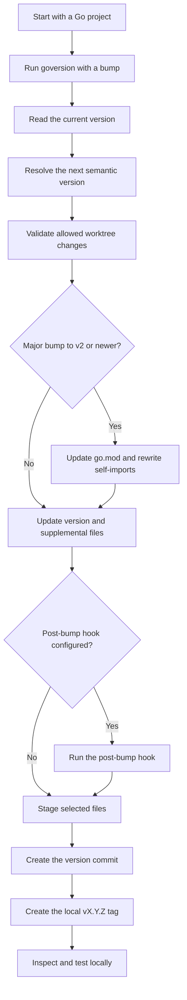
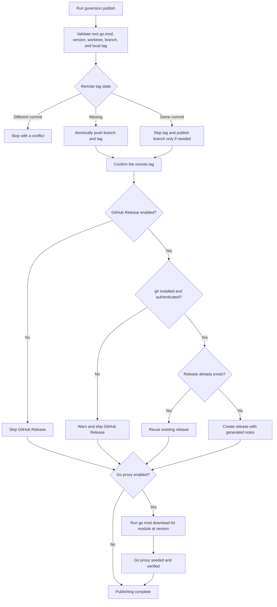

# goversion
[![Actions Status][action-img]][action-url]
[![SocketDev][socket-image]][socket-url]
[![PkgGoDev][pkg-go-dev-img]][pkg-go-dev-url]

[action-img]: https://github.com/bcomnes/goversion/actions/workflows/test.yml/badge.svg
[action-url]: https://github.com/bcomnes/goversion/actions/workflows/test.yml
[pkg-go-dev-img]: https://pkg.go.dev/badge/github.com/bcomnes/goversion/v2
[pkg-go-dev-url]: https://pkg.go.dev/github.com/bcomnes/goversion/v2
[socket-image]: https://socket.dev/api/badge/go/package/github.com/bcomnes/goversion?version=v1.0.2
[socket-url]: https://socket.dev/go/package/github.com/bcomnes/goversion?version=v1.0.2

`goversion` is a tool and library for bumping semantic versions and publishing releases for Go projects.
It updates a `version.go` file, creates the version commit and tag, publishes a GitHub Release, and seeds the Go module proxy.
It is intended for use with `go tool`s that are consumed from source.

It offers unique benefits over the following more conventional approaches.

- `go generate` can generate Go code from Git commits, but it runs too late to capture the current tag in source before a version commit.
- Build flags can insert version tags into binaries, but `go tool` consumes source code rather than prebuilt binaries.
- Bumping `version.go` before creating the version commit lets tools consumed through `go tool` inspect their version from source.

Bump, test, and publish a Go release:

```console
goversion patch # bump the version and create its commit and tag
go test ./... # validate the release commit
goversion publish # publish Git refs and a GitHub Release, then seed the Go proxy
```

## Features

- **Semantic Version Bumping:** Support for bumping versions using keywords (major, minor, patch, premajor, preminor, prepatch, prerelease, and from-git) or setting an explicit version.
- **Git Integration:** Automatically stages updated files, commits changes with the new version as the commit message, and tags the commit with the new version.
- **Go Module Publishing:** Validates a release, atomically publishes only incomplete Git refs, creates or reuses a GitHub Release through `gh`, and seeds the Go module proxy.
- **CLI and Library:** Offers both a command-line interface for quick version updates and a library for integrating version management into your applications.
- **Flexible Configuration:** Specify the path to your version file and include additional files for Git staging.
- **Module Path Updates:** Updates `go.mod` and package self-imports for major versions that require a `/vN` suffix.
- **Supplemental File Bumping:** Bump a semantic version in additional Go project metadata files by finding and replacing the first semantic version.
- **Post-bump Hooks:** Run custom scripts after version bumping but before committing, with access to old and new version via environment variables.

## Lifecycles

A Go release moves through a local versioning lifecycle followed by a publishing lifecycle.
The local stage leaves time to inspect and test the version before updating remote state.

### Local versioning lifecycle



Once the local version commit and tag are ready, `goversion publish` handles the remote release.
A dry run performs the publishing preflight without changing remote state.

### Go module publishing lifecycle



## Install

Install the standalone command with [Homebrew](https://brew.sh):

```console
brew install bcomnes/tap/goversion
```

This adds the `bcomnes/tap` tap automatically.
Run `goversion -help` for usage and update it later with `brew upgrade goversion`.

For a project-pinned Go tool instead:

```console
go get -tool github.com/bcomnes/goversion/v2
```

## Usage

### Command-Line Interface

The `goversion` CLI defaults to using `./version.go` as the version file, but you can override this with the `-version-file` flag. Use the `-file` flag to specify additional files to be staged.

```
go tool github.com/bcomnes/goversion/v2 [flags] <version-bump>
go tool github.com/bcomnes/goversion/v2 publish [flags]
```

#### Flags

- `-version-file`: Path to the Go file containing the version declaration. (Default: `./version.go`)
- `-file`: Additional file to include in the commit. This flag can be used multiple times.
- `-bump-file`: Additional Go project metadata file to scan for the first semantic version and bump. This flag can be used multiple times. Only valid semver strings are matched (no "v" prefix).
- `-post-bump`: Script to execute after version bump but before git commit. Receives `GOVERSION_OLD_VERSION` and `GOVERSION_NEW_VERSION` environment variables. Files created or modified by the script must be specified with `-file` to be included in the commit.
- `-version`: Show the version of the `goversion` CLI tool and exit.
- `-help`: Show usage instructions.

#### Bump Directives

The `<version-bump>` argument can be:

- **Keywords for semantic bumps:**
  - `major` – 1.2.3 → 2.0.0
  - `minor` – 1.2.3 → 1.3.0
  - `patch` – 1.2.3 → 1.2.4
  - `premajor` – 1.2.3 → 2.0.0-0
  - `preminor` – 1.2.3 → 1.3.0-0
  - `prepatch` – 1.2.3 → 1.2.4-0
  - `prerelease` – 1.2.3 → 1.2.4-0 (or bumps prerelease: 1.2.4-0 → 1.2.4-1)

- **Special source:**
  - `from-git` – use the latest Git tag (e.g. `v1.2.3`) as the version.

- **Explicit version strings (must be valid semver):**
  - `1.2.3` – set exact version
  - `2.0.0-alpha.1` – set prerelease version
  - `dev` – special non-semver string that initializes the version file (used for bootstrapping)

#### Supplemental File Bumping

The `-bump-file` flag allows a Go project to update the first valid semantic version in supplemental project metadata:

- Only matches strict semver format with no `v` prefix.
- Replaces only the first occurrence.
- Useful for generated documentation, release metadata, and other files shipped with a Go project.

#### Post-bump Scripts

The `-post-bump` flag runs a script after version bumping but before committing:

- Script receives environment variables:
  - `GOVERSION_OLD_VERSION` - the version before bumping
  - `GOVERSION_NEW_VERSION` - the new version after bumping
- Script output is displayed to the user
- If the script fails, the entire operation is aborted
- Files created/modified by the script must be explicitly included with `-file`
- Common use cases: generating docs, updating changelogs, building artifacts

#### Examples

```console
# Bump patch version (1.2.3 → 1.2.4)
goversion patch

# Bump minor version (1.2.3 → 1.3.0)
goversion minor

# Bump pre-release version (1.2.4-0 → 1.2.4-1)
goversion prerelease

# Set an explicit version
goversion 2.0.0

# Set a prerelease version
goversion 2.1.0-beta.1

# Use version from Git tag
goversion from-git

# Include README.md in the commit
goversion -file=README.md patch

# Use a custom version file path
goversion -version-file=internal/version.go minor

# Bump a version recorded in generated documentation
goversion -bump-file=docs/version.txt patch

# Run a post-bump script that generates docs
# Note: Files created by the script must be included with -file
goversion -post-bump=./scripts/update-docs.sh -file=docs/version.md minor

# Combine multiple features
goversion -version-file=./version.go -bump-file=docs/version.txt -post-bump=./update.sh -file=CHANGELOG.md patch
```

This command will:
- Bump the version in the given file.
- Stage the updated version file (plus any `-file` flags).
- Commit with the new version as the commit message (no `v` prefix).
- Tag the commit with the new version (with `v` prefix).
- For major version bumps ≥ v2, update go.mod module path and rewrite self-imports.

> **Note**: The working directory must be clean (no unstaged/uncommitted changes outside the listed files) or the command will fail to prevent accidental commits.

### Publishing

Create a version, run the project validation you require, and publish the Go release:

```console
goversion patch
go test ./...
goversion publish
```

`goversion publish` performs the following guarded steps:

1. Reads the existing version from `version.go` and validates it against the module path in `go.mod`.
2. Requires a repository-root Go module, a clean worktree, a current branch, and a matching local `vX.Y.Z` tag at `HEAD`.
3. Rejects an existing remote tag when it points to a different commit.
4. Atomically publishes only incomplete branch or version-tag refs to the configured remote.
5. Creates or reuses a GitHub Release with generated notes through the authenticated `gh` CLI.
6. Seeds and verifies the complete module through `go mod download` using the configured Go proxy.

If `gh` is missing or unauthenticated, publishing continues without a GitHub Release and prints an actionable warning.
A failure from an available and authenticated `gh` command remains fatal so a real release error is not silently ignored.
Use `-no-release` to intentionally omit the GitHub Release or `-no-proxy` for a private module that should not reach the public proxy.
The CLI prints each phase before starting it and streams stdout and stderr from each external `git`, `gh`, or `go` command as it runs.
Each external command has a two-minute timeout by default.
Proxy seeding reports each attempt and retries recognized transient HTTP and network failures up to three times with short backoff.
It disables checksum-database lookup for this isolated fetch so `sum.golang.org` availability cannot block verification of the configured module proxy.
Permanent module and proxy-response failures are not retried.
Use `-timeout` to change the per-command limit or a negative duration such as `-timeout=-1s` to disable it.
Nested Go modules are rejected because the existing versioning step creates repository-root tags.

```console
goversion publish -dry
goversion publish -remote upstream
goversion publish -proxy https://proxy.golang.org
goversion publish -timeout 5m
goversion publish -no-release
goversion publish -no-proxy
```

Publishing is resumable after a failure.
Each branch, tag, GitHub Release, and proxy step reports a `planned`, `completed`, `reused`, or `skipped` status.
On retry, `goversion` skips Git refs that already point to the expected commit, reuses an existing GitHub Release, and continues with the first incomplete stage.
If proxy seeding was the failed stage, read-only Git and GitHub checks are repeated before retrying the proxy request.
It reports a `pkg.go.dev` URL, but documentation indexing may complete asynchronously after the proxy accepts the module.

### Library Usage

You can also integrate goversion into your Go programs. For example:

```go
package main

import (
	"fmt"
	"log"

	"github.com/bcomnes/goversion/v2/pkg"
)

func main() {
	// Basic version bump
	meta, err := goversion.Run("./version.go", "minor", []string{"./version.go"}, []string{}, "")
	if err != nil {
		log.Fatalf("version bump failed: %v", err)
	}
	fmt.Printf("Bumped from %s to %s\n", meta.OldVersion, meta.NewVersion)

	// With an additional Go project metadata file to bump
	bumpFiles := []string{"docs/version.txt"}
	meta, err = goversion.Run("./version.go", "patch", []string{"./version.go"}, bumpFiles, "")
	if err != nil {
		log.Fatalf("version bump failed: %v", err)
	}

	// Dry run to see what would change
	meta, err = goversion.DryRun("./version.go", "major", []string{"docs/version.txt"})
	if err != nil {
		log.Fatalf("dry run failed: %v", err)
	}
	fmt.Printf("Would update files: %v\n", meta.UpdatedFiles)

	// Publish the validated local version commit and tag.
	published, err := goversion.Publish(goversion.PublishOptions{})
	if err != nil {
		log.Fatalf("publish failed: %v", err)
	}
	fmt.Printf("Published %s@%s\n", published.ModulePath, published.Version)
}
```

## API Documentation

For detailed API documentation, visit [PkgGoDev][pkg-go-dev-url].

## License

This project is licensed under the MIT License.
