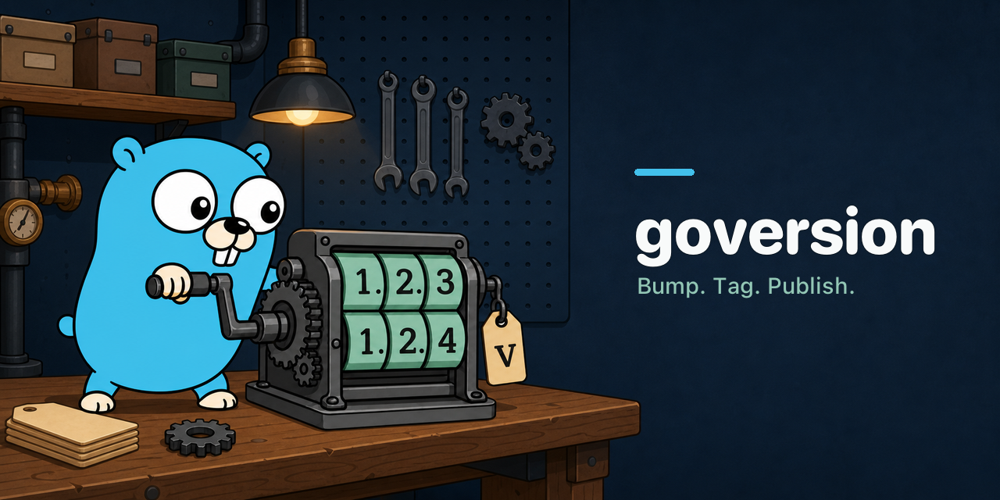
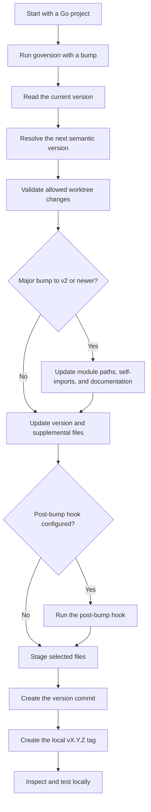
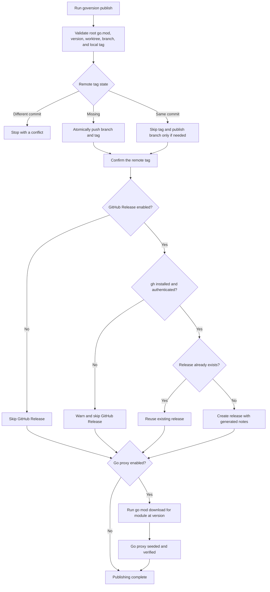
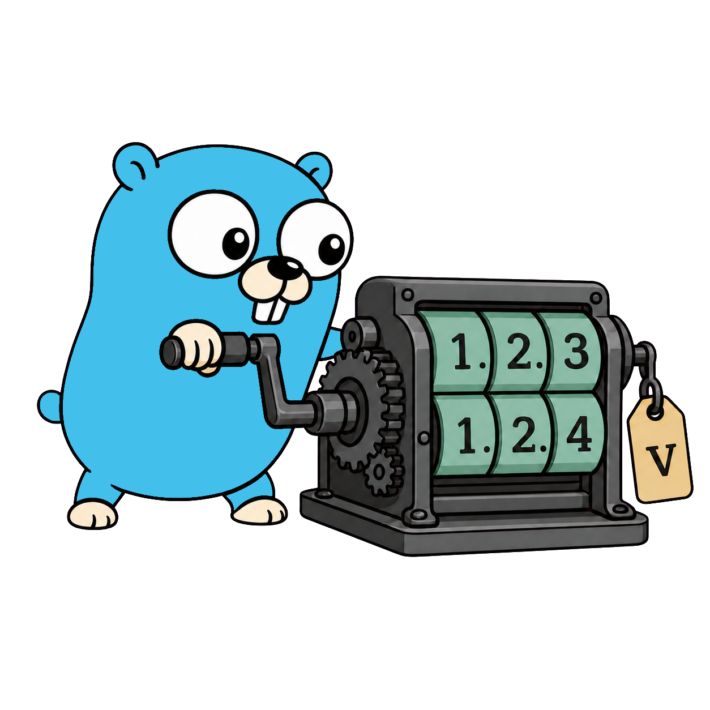

# goversion

[![Actions Status][action-img]][action-url]
[![SocketDev][socket-image]][socket-url]
[![PkgGoDev][pkg-go-dev-img]][pkg-go-dev-url]

[action-img]: https://github.com/bcomnes/goversion/actions/workflows/test.yml/badge.svg
[action-url]: https://github.com/bcomnes/goversion/actions/workflows/test.yml
[pkg-go-dev-img]: https://pkg.go.dev/badge/github.com/bcomnes/goversion/v2
[pkg-go-dev-url]: https://pkg.go.dev/github.com/bcomnes/goversion/v2
[socket-image]: https://socket.dev/api/badge/go/package/github.com/bcomnes/goversion?version=v1.0.2
[socket-url]: https://socket.dev/go/package/github.com/bcomnes/goversion?version=v1.0.2

`goversion` is a tool and library for bumping semantic versions and publishing releases for Go projects.
It updates a `version.go` file, creates the version commit and tag, publishes a GitHub Release, and seeds the Go module proxy.
It is intended for use with `go tool`s that are consumed from source.

It offers unique benefits over the following more conventional approaches.

- `go generate` can generate Go code from Git commits, but it runs too late to capture the current tag in source before a version commit.
- Build flags can insert version tags into binaries, but `go tool` consumes source code rather than prebuilt binaries.
- Bumping `version.go` before creating the version commit lets tools consumed through `go tool` inspect their version from source.

Bump, test, and publish a Go release:

```console
goversion patch # bump the version and create its commit and tag
go test ./... # validate the release commit
goversion publish # publish Git refs and a GitHub Release, then seed the Go proxy
```

## Features

- **Semantic Version Bumping:** Support for bumping versions using keywords (major, minor, patch, premajor, preminor, prepatch, prerelease, and from-git) or setting an explicit version.
- **Git Integration:** Automatically stages updated files, commits changes with the new version as the commit message, and creates the canonical Go module tag (`vX.Y.Z` at the repository root or `<module-dir>/vX.Y.Z` for a nested module).
- **Go Module Publishing:** Validates a release, atomically publishes only incomplete Git refs, creates or reuses a GitHub Release through `gh`, and seeds the Go module proxy.
- **CLI and Library:** Offers both a command-line interface for quick version updates and a library for integrating version management into your applications.
- **Flexible Configuration:** Specify the path to your version file and include additional files for Git staging.
- **Module Path Updates:** Updates `go.mod`, package self-imports, and documentation references for major versions that require a `/vN` suffix.
- **Supplemental File Bumping:** Bump a semantic version in additional Go project metadata files by finding and replacing the first semantic version.
- **Post-bump Hooks:** Run custom scripts after version bumping but before committing, with access to old and new version via environment variables.

## Lifecycles

A Go release moves through a local versioning lifecycle followed by a publishing lifecycle.
The local stage leaves time to inspect and test the version before updating remote state.

### Local versioning lifecycle


```mermaid
flowchart TD
    A[Start with a Go project] --> B[Run goversion with a bump]
    B --> C[Read the current version]
    C --> D[Resolve the next semantic version]
    D --> E[Validate allowed worktree changes]
    E --> F{Major bump to v2 or newer?}
    F -- Yes --> G[Update module paths, self-imports, and documentation]
    F -- No --> H[Update version and supplemental files]
    G --> H
    H --> I{Post-bump hook configured?}
    I -- Yes --> J[Run the post-bump hook]
    I -- No --> K[Stage selected files]
    J --> K
    K --> L[Create the version commit]
    L --> M[Create the local vX.Y.Z tag]
    M --> N[Inspect and test locally]
```

Once the local version commit and tag are ready, `goversion publish` handles the remote release.
A dry run performs the publishing preflight without changing remote state.

### Go module publishing lifecycle


```mermaid
flowchart TD
    A[Run goversion publish] --> B[Validate root go.mod, version, worktree, branch, and local tag]
    B --> C{Remote tag state}
    C -- Different commit --> D[Stop with a conflict]
    C -- Missing --> E[Atomically push branch and tag]
    C -- Same commit --> F[Skip tag and publish branch only if needed]
    E --> G[Confirm the remote tag]
    F --> G
    G --> H{GitHub Release enabled?}
    H -- No --> I[Skip GitHub Release]
    H -- Yes --> J{gh installed and authenticated?}
    J -- No --> K[Warn and skip GitHub Release]
    J -- Yes --> L{Release already exists?}
    L -- Yes --> M[Reuse existing release]
    L -- No --> N[Create release with generated notes]
    I --> O{Go proxy enabled?}
    K --> O
    M --> O
    N --> O
    O -- No --> P[Publishing complete]
    O -- Yes --> Q[Run go mod download for module at version]
    Q --> R[Go proxy seeded and verified]
    R --> P
```

## Install

Install the standalone command with [Homebrew](https://brew.sh):

```console
brew install bcomnes/tap/goversion
```

This adds the `bcomnes/tap` tap automatically.
Run `goversion -help` for usage and update it later with `brew upgrade goversion`.

For a project-pinned Go tool instead:

```console
go get -tool github.com/bcomnes/goversion/v2
```

## Usage

### GitHub Actions companion

[`go-bump`](https://github.com/bcomnes/go-bump) is the companion GitHub Action for running a `goversion` release in CI. `goversion` remains the local-first workflow: register it as a project-pinned Go tool so contributors can create, validate, publish, and recover releases locally. `go-bump` uses that same pinned tool and adds GitHub Actions input handling, credentials, Git identity, lifecycle hooks, and outputs.

See the [`go-bump` documentation](https://github.com/bcomnes/go-bump#readme) for current workflow examples, requirements, inputs, outputs, nested-module configuration, publication controls, and recovery behavior.

### Command-Line Interface

The `goversion` CLI defaults to the module in the current directory and `./version.go`. Use `-workdir` to select a root or nested module without changing the caller's working directory. Relative `-version-file`, `-file`, `-bump-file`, and `-post-bump` paths are resolved within that workdir.

```
go tool github.com/bcomnes/goversion/v2 [flags] <version-bump>
go tool github.com/bcomnes/goversion/v2 publish [flags]
```

#### Flags

- `-workdir`: Go module working directory used for versioning paths, Git operations, and post-bump execution. (Default: `.`)
- `-version-file`: Path to the Go file containing the version declaration, relative to `-workdir`. (Default: `./version.go`)
- `-file`: Additional file to include in the commit. This flag can be used multiple times.
- `-bump-file`: Additional Go project metadata file to scan for the first semantic version and bump. This flag can be used multiple times. Only valid semver strings are matched (no "v" prefix).
- `-post-bump`: Script to execute after version bump but before git commit. Receives `GOVERSION_OLD_VERSION` and `GOVERSION_NEW_VERSION` environment variables. Files created or modified by the script must be specified with `-file` to be included in the commit.
- `-skip-docs`: Skip automatic documentation path updates during major bumps, including dry runs.
  Module paths, self-imports, explicit bump files, and post-bump hooks are unaffected.
- `-version`: Show the version of the `goversion` CLI tool and exit.
- `-help`: Show usage instructions.

#### Bump Directives

The `<version-bump>` argument can be:

- **Keywords for semantic bumps:**
  - `major` – 1.2.3 → 2.0.0
  - `minor` – 1.2.3 → 1.3.0
  - `patch` – 1.2.3 → 1.2.4
  - `premajor` – 1.2.3 → 2.0.0-0
  - `preminor` – 1.2.3 → 1.3.0-0
  - `prepatch` – 1.2.3 → 1.2.4-0
  - `prerelease` – 1.2.3 → 1.2.4-0 (or bumps prerelease: 1.2.4-0 → 1.2.4-1)

- **Special source:**
  - `from-git` – use the latest Git tag (e.g. `v1.2.3`) as the version.

- **Explicit version strings (must be valid semver):**
  - `1.2.3` – set exact version
  - `2.0.0-alpha.1` – set prerelease version
  - `dev` – special non-semver string that initializes the version file (used for bootstrapping)

#### Supplemental File Bumping

The `-bump-file` flag allows a Go project to update the first valid semantic version in supplemental project metadata:

- Only matches strict semver format with no `v` prefix.
- Replaces only the first occurrence.
- Useful for generated documentation, release metadata, and other files shipped with a Go project.

#### Post-bump Scripts

The `-post-bump` flag runs a script after version bumping but before committing:

- Script receives environment variables:
  - `GOVERSION_OLD_VERSION` - the version before bumping
  - `GOVERSION_NEW_VERSION` - the new version after bumping
- Script output is displayed to the user
- If the script fails, the entire operation is aborted
- Files created/modified by the script must be explicitly included with `-file`
- Common use cases: generating docs, updating changelogs, building artifacts

#### Examples

```console
# Bump patch version (1.2.3 → 1.2.4)
goversion patch

# Bump a nested module and create tools/widget/v1.2.4
goversion -workdir tools/widget patch

# Bump minor version (1.2.3 → 1.3.0)
goversion minor

# Bump pre-release version (1.2.4-0 → 1.2.4-1)
goversion prerelease

# Set an explicit version
goversion 2.0.0

# Set a prerelease version
goversion 2.1.0-beta.1

# Use version from Git tag
goversion from-git

# Include README.md in the commit
goversion -file=README.md patch

# Use a custom version file path
goversion -version-file=internal/version.go minor

# Bump a version recorded in generated documentation
goversion -bump-file=docs/version.txt patch

# Run a post-bump script that generates docs
# Note: Files created by the script must be included with -file
goversion -post-bump=./scripts/update-docs.sh -file=docs/version.md minor

# Combine multiple features
goversion -version-file=./version.go -bump-file=docs/version.txt -post-bump=./update.sh -file=CHANGELOG.md patch
```

This command will:
- Bump the version in the given file.
- Stage the updated version file (plus any `-file` flags).
- Commit with the new version as the commit message (no `v` prefix).
- Tag the commit with the canonical module tag: `vX.Y.Z` for a root module or `<module-dir>/vX.Y.Z` for a nested module.
- For major version bumps ≥ v2, update the `go.mod` module path, self-imports, and documentation references.

> **Note**: The working directory must be clean (no unstaged/uncommitted changes outside the listed files) or the command will fail to prevent accidental commits.

### Major-version documentation updates

`goversion major` updates module references in Markdown (`.md`, `.markdown`) and Go comments alongside the module path:

| Before | After a v2 major bump |
| --- | --- |
| `https://pkg.go.dev/example.com/widget#Client` | `https://pkg.go.dev/example.com/widget/v2#Client` |
| `https://pkg.go.dev/badge/example.com/widget.svg` | `https://pkg.go.dev/badge/example.com/widget/v2.svg` |
| `https://godoc.org/example.com/widget/client` | `https://godoc.org/example.com/widget/v2/client` |
| `import "example.com/widget/client"` in an example | `import "example.com/widget/v2/client"` |
| `go get example.com/widget@latest` | `go get example.com/widget/v2@latest` |

Later major bumps replace the suffix, such as `/v2` → `/v3`.
Changes are committed automatically; preview them with `goversion -dry major`.

- **Preserved:** anchors, query parameters, pinned versions (`@v1.2.3`), references to other major versions or modules, repository URLs, and runtime strings.
- **Module-scoped:** nested modules and references to their declared paths stay unchanged.
- **Git-aware:** tracked and nonignored files are eligible; fully ignored trees such as `node_modules` are pruned before descent.
  Tracked files and ignore exceptions remain eligible regardless of directory name; `vendor`, `.git`, and symlinks are always skipped.

This follows the `major` command's module-path migration; explicit versions and `premajor` do not migrate module paths.

#### Skip all documentation updates

```console
goversion -skip-docs major
goversion -skip-docs -dry major
```

Only automatic documentation rewriting is disabled; version updates, `go.mod`, self-imports, `-bump-file`, and hooks still run.
Library callers can set [`VersionOptions.SkipDocs`](https://pkg.go.dev/github.com/bcomnes/goversion/v2/pkg#VersionOptions) with `RunWithOptions` or `DryRunWithOptions`.

#### Keep an individual reference

To keep a v2 link when bumping to v3:

```markdown
<!-- goversion:ignore-next-line -->
See the [v2 API](https://pkg.go.dev/example.com/widget/v2#Client).
```

In Go documentation, use a standalone line comment:

```go
// goversion:ignore-next-line
// Previous API: https://pkg.go.dev/example.com/widget/v2#Client
```

The directive protects the next physical line only; a blank line consumes it.
Both real and dry runs honor it for documentation, not actual imports or `go.mod`.
The HTML directive is hidden when rendered; the Go comment appears in generated documentation.

### Publishing

Create a version, test it, and publish:

```console
goversion patch
go test ./...
goversion publish
```

Preview the release without changing remote state:

```console
goversion publish -dry
```

Publishing requires a clean worktree, a current branch, and the version's canonical local tag at `HEAD`.
The module must be inside the Git repository, and its `go.mod` path must match the version in `version.go`.
A remote tag pointing to a different commit is rejected.

Once validated, `goversion`:

1. Atomically pushes branch and version-tag refs that are not already published.
2. Creates or reuses a GitHub Release with generated notes through `gh`.
3. Downloads and verifies the module through the Go proxy.

#### Customize publishing

| Option | Purpose |
| --- | --- |
| `-remote upstream` | Push to a different Git remote. |
| `-proxy https://proxy.golang.org` | Select the Go module proxy. |
| `-no-release` | Skip the GitHub Release. |
| `-no-proxy` | Skip proxy access, for example for a private module. |
| `-timeout 5m` | Change the two-minute per-command timeout; `-timeout=-1s` disables it. |
| `-major-branch` | Update a moving `vN` branch for GitHub Action consumers after publishing succeeds. |

If `gh` is missing or unauthenticated, publishing continues with a warning and no GitHub Release.
Errors from an available, authenticated `gh` remain fatal.

#### Publish a nested module

Use the same module directory for versioning and publishing:

```console
goversion -workdir tools/widget patch
goversion publish -workdir tools/widget
```

The module uses tags such as `tools/widget/v2.0.1`.
Tags belonging to other modules are ignored; each invocation versions or publishes only the selected module.

#### Retry a failed publish

Run `goversion publish` again after fixing the failure.
It rechecks Git and GitHub state, skips refs already pointing to the expected commit, and reuses an existing GitHub Release.
Each stage reports `planned`, `completed`, `reused`, or `skipped`, with command output streamed as it runs.

Proxy seeding retries recognized transient HTTP and network failures up to three times with short backoff; permanent failures are not retried.
The isolated download disables checksum-database lookup so `sum.golang.org` availability cannot block proxy verification.
The reported `pkg.go.dev` URL may become available later, since documentation indexing is asynchronous.

#### Publish a moving major branch

For GitHub Actions consumed as `owner/action@v2`:

```console
goversion publish -major-branch
```

The `vN` branch is derived from the release version and updated only after the release and proxy steps succeed.
A force-with-lease pinned to the remote value observed during preflight protects against overwriting concurrent updates.

### Library Usage

You can also integrate goversion into your Go programs. For example:

```go
package main

import (
	"fmt"
	"log"

	"github.com/bcomnes/goversion/v2/pkg"
)

func main() {
	// Basic version bump
	meta, err := goversion.Run("./version.go", "minor", []string{"./version.go"}, []string{}, "")
	if err != nil {
		log.Fatalf("version bump failed: %v", err)
	}
	fmt.Printf("Bumped from %s to %s\n", meta.OldVersion, meta.NewVersion)

	// With an additional Go project metadata file to bump
	bumpFiles := []string{"docs/version.txt"}
	meta, err = goversion.Run("./version.go", "patch", []string{"./version.go"}, bumpFiles, "")
	if err != nil {
		log.Fatalf("version bump failed: %v", err)
	}

	// Dry run to see what would change
	meta, err = goversion.DryRun("./version.go", "major", []string{"docs/version.txt"})
	if err != nil {
		log.Fatalf("dry run failed: %v", err)
	}
	fmt.Printf("Would update files: %v\n", meta.UpdatedFiles)

	// Publish the validated local version commit and tag.
	published, err := goversion.Publish(goversion.PublishOptions{})
	if err != nil {
		log.Fatalf("publish failed: %v", err)
	}
	fmt.Printf("Published %s@%s\n", published.ModulePath, published.Version)
}
```

## API Documentation

For detailed API documentation, visit [PkgGoDev][pkg-go-dev-url].

## License

This project is licensed under the MIT License.


